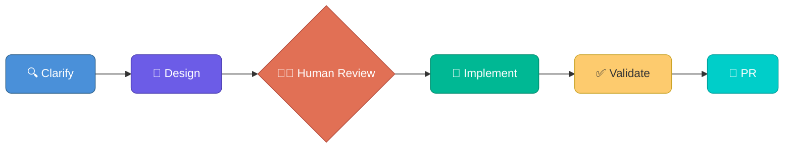

# Terraform Agentic Workflows

[](LICENSE)
[](https://www.terraform.io/)

A framework for agentic Infrastructure as Code development workflows using **Spec-Driven Development (SDD)** — a structured approach that guides AI agents through building production-ready Terraform code with guardrails at every phase. Built on industry standards like [agent skills](https://agentskills.io/) and subagents, this framework is designed to be generic and can be customized to work with any AI coding harness that supports these primitives. Validated with **Claude Code** and **GitHub Copilot CLI**. Coming soon Project Bob ...

> **Guardrails matter.** Agentic AI for critical infrastructure requires mature IaC practices and strong operational guardrails to deliver successful outcomes. **HCP Terraform** is a key component of this approach — providing remote execution, policy enforcement, state management, and approval workflows that keep AI-generated infrastructure safe and auditable.
>
> 
>
> **Note:** This repository is a framework for agentic development workflows for Infrastructure as Code. Customization to a customer's specific requirements, security posture, and best practices should be undertaken as a Resident Solutions Architect (RSA) engagement.
>
> **Learn more:** Visit [AI-Powered Infrastructure Engineering at Enterprise Scale](https://pages.github.ibm.com/AdvArch/tfai/) — a structured learning path for platform teams adopting autonomous HCP Terraform development, covering agent architecture, layered guardrails, Specification-Driven Development, and three validated workflow patterns.

## What is this?

This repository is a development template, not a deployed module. It provides orchestrated AI agent workflows for three core Terraform use cases, each following the same structure:



- **Clarify** — Gather requirements, resolve ambiguity, research AWS/provider docs
- **Design** — Produce a design document with architecture, interfaces, security controls
- **Human Review** — Approve the design before any code is written
- **Implement** — TDD: write tests first, then build to pass them
- **Validate** — Run the full quality pipeline (fmt, validate, test, tflint, trivy, docs)
- **PR** — Create a pull request with the implementation for final review

**Why use this?** Writing production-grade Terraform by hand is slow and error-prone — security defaults get missed, tests are skipped, documentation drifts. SDD with AI agents enforces quality at every phase, producing consistent, tested, documented infrastructure code in a fraction of the time.

**Can't I build my own workflows?** Yes — and many teams do. But getting agentic IaC right is harder than it looks. Naive prompting produces code that works in demos but fails in production: no tests, no security defaults, inconsistent structure, and no guardrails to prevent drift. This framework encodes months of iteration into reusable skills, constitutions, and validation pipelines. You get a proven starting point instead of rebuilding the same lessons from scratch — and because it's built on open standards (agent skills, subagents, MCP), you can extend and customize it rather than being locked in.

## Quick Start

**Prerequisites:** Docker Desktop, VS Code, GitHub fine-grained PAT, HCP Terraform Team API token, and either a **Claude Code** subscription or **GitHub Copilot** license.

```bash
# 1. Create a new repo from this template on GitHub, then clone it
git clone https://github.com/YOUR_ORG/your-new-repo.git
code your-new-repo

# 2. When VS Code prompts, click "Reopen in Container"
#    Choose claude-code or vscode-agent variant depending on your AI assistant

# 3. Validate your environment
bash .foundations/scripts/bash/validate-env.sh
```

All other tools (Terraform, TFLint, terraform-docs, Trivy, Go, GitHub CLI, and more) are pre-installed in the devcontainer.

See the **[Getting Started Guide](docs/getting_started.md)** for complete setup instructions including token configuration and branch protection.

## Core Workflows

Start any workflow by typing the slash command in your AI assistant's chat (Claude Code terminal or Copilot Chat). The same slash commands work in both tools:

| Workflow | Purpose | Plan & Design | Implement & Validate |
|----------|---------|----------------|----------------------|
| **Module Authoring** | Create reusable Terraform modules with direct provider resources and secure defaults | `/tf-module-plan` | `/tf-module-implement` |
| **Provider Development** | Build Terraform Provider resources using the Plugin Framework | `/tf-provider-plan` | `/tf-provider-implement` |
| **Consumer Provisioning** | Compose infrastructure from private registry modules | `/tf-consumer-plan` | `/tf-consumer-implement` |

## Day 2 Operations

The **consumer module uplift** pipeline automates dependency management for consumer configurations:

1. **Dependabot** detects new module versions in the private registry
2. **GitHub Actions** classifies the version bump, runs `terraform plan`, and assesses risk
3. **Low-risk changes** (patch, adds-only) are auto-merged
4. **Breaking changes** trigger `@claude` — an AI agent that fetches the old/new module interfaces, fixes consumer code, and pushes the fix for re-validation

See [Day 2 Operations](docs/getting_started.md#day-2-operations--consumer-module-uplift) for full details.

## MCP Servers

Pre-configured [Model Context Protocol](https://modelcontextprotocol.io/) servers extend AI agent capabilities:

| Server | Description |
|--------|-------------|
| `terraform` | HCP Terraform — workspace management, run execution, registry lookups, variable management |
| `aws-documentation-mcp-server` | AWS documentation search, best practices, service recommendations |

Configured in `.mcp.json` and available automatically in the devcontainer.

## What's Included

- **Devcontainer** — Two variants: `claude-code` (Claude Code CLI) and `vscode-agent` (GitHub Copilot), both with Terraform 1.14, TFLint, terraform-docs, Trivy, Go 1.24, GitHub CLI, Vault Radar, Infracost, Checkov, golangci-lint, and pre-commit
- **Pre-commit hooks** — fmt, validate, docs, tflint, trivy, secret detection, Vault Radar (requires optional `VAULT_RADAR_LICENSE`)
- **TFLint** — AWS (0.46.0), Azure (0.31.1), and Terraform plugins with all 20 rules configured
- **Constitutions** — Non-negotiable rules for module, provider, and consumer code generation
- **Design templates** — Canonical starting points for each workflow's design phase
- **CI/CD pipelines** — Validation, apply, release, and consumer uplift workflows

## Documentation

| Resource | Description |
|----------|-------------|
| [Getting Started](docs/getting_started.md) | Environment setup and first workflow |
| [Documentation Site](docs/index.html) | Full reference site (open locally in browser — not rendered on GitHub) |
| [AGENTS.md](AGENTS.md) | Agent inventory, skills, and context management rules |

## Validated Models

This solution has been validated with the following models (listed in order of observed performance):

| Rank | Model | Provider |
|------|-------|----------|
| 1 | Opus 4.6 | Anthropic |
| 2 | ChatGPT 5.4 | OpenAI |
| 3 | Gemini 3 Pro | Google |

Model choice is up to customer preference — all three produce production-quality output. Evals generally show best results in the order above.

## Contributing

Contributions are welcome. Please open an issue to discuss proposed changes before submitting a pull request.

## License

This project is licensed under the [Apache License 2.0](LICENSE).
