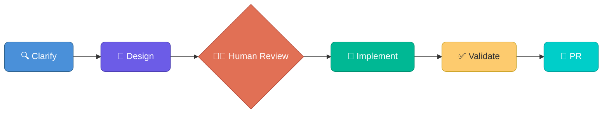

# Terraform Agentic Workflows

[](LICENSE)
[](https://www.terraform.io/)

A framework for agentic Infrastructure as Code development workflows using **Spec-Driven Development (SDD)** — a structured approach that guides AI agents through building production-ready Terraform code with guardrails at every phase. Built on industry standards like [agent skills](https://agentskills.io/) and subagents, this framework is designed to be generic and can be customized to work with any AI coding harness that supports these primitives. Validated with **Claude Code** and **GitHub Copilot CLI**. Coming soon Project Bob ...

> **Guardrails matter.** Agentic AI for critical infrastructure requires mature IaC practices and strong operational guardrails to deliver successful outcomes. **HCP Terraform** is a key component of this approach — providing remote execution, policy enforcement, state management, and approval workflows that keep AI-generated infrastructure safe and auditable.
>
> 
>
> **Note:** This repository is a framework for agentic development workflows for Infrastructure as Code. Customization to a customer's specific requirements, security posture, and best practices should be undertaken as a Resident Solutions Architect (RSA) engagement.
>
> **Learn more:** Visit [AI-Powered Infrastructure Engineering at Enterprise Scale](https://pages.github.ibm.com/AdvArch/tfai/) — a structured learning path for platform teams adopting autonomous HCP Terraform development, covering agent architecture, layered guardrails, Specification-Driven Development, and three validated workflow patterns.

## What is this?

This repository is a development template, not a deployed module. It provides orchestrated AI agent workflows for three core Terraform use cases, each following the same structure:



- **Clarify** — Gather requirements, resolve ambiguity, research AWS/provider docs
- **Design** — Produce a design document with architecture, interfaces, security controls
- **Human Review** — Approve the design before any code is written
- **Implement** — TDD: write tests first, then build to pass them
- **Validate** — Run the full quality pipeline (fmt, validate, test, tflint, trivy, docs)
- **PR** — Create a pull request with the implementation for final review

**Why use this?** Writing production-grade Terraform by hand is slow and error-prone — security defaults get missed, tests are skipped, documentation drifts. SDD with AI agents enforces quality at every phase, producing consistent, tested, documented infrastructure code in a fraction of the time.

**Can't I build my own workflows?** Yes — and many teams do. But getting agentic IaC right is harder than it looks. Naive prompting produces code that works in demos but fails in production: no tests, no security defaults, inconsistent structure, and no guardrails to prevent drift. This framework encodes months of iteration into reusable skills, constitutions, and validation pipelines. You get a proven starting point instead of rebuilding the same lessons from scratch — and because it's built on open standards (agent skills, subagents, MCP), you can extend and customize it rather than being locked in.

## Quick Start

**Prerequisites:** Docker Desktop, VS Code, GitHub fine-grained PAT, HCP Terraform Team API token, and either a **Claude Code** subscription or **GitHub Copilot** license.

```bash
# 1. Create a new repo from this template on GitHub, then clone it
git clone https://github.com/YOUR_ORG/your-new-repo.git
code your-new-repo

# 2. When VS Code prompts, click "Reopen in Container"
#    Choose claude-code or vscode-agent variant depending on your AI assistant

# 3. Validate your environment
bash .foundations/scripts/bash/validate-env.sh
```

All other tools (Terraform, TFLint, terraform-docs, Trivy, Go, GitHub CLI, and more) are pre-installed in the devcontainer.

See the **[Getting Started Guide](docs/getting_started.md)** for complete setup instructions including token configuration and branch protection.

## Core Workflows

Start any workflow by typing the slash command in your AI assistant's chat (Claude Code terminal or Copilot Chat). The same slash commands work in both tools:

| Workflow | Purpose | Plan & Design | Implement & Validate |
|----------|---------|----------------|----------------------|
| **Module Authoring** | Create reusable Terraform modules with direct provider resources and secure defaults | `/tf-module-plan` | `/tf-module-implement` |
| **Provider Development** | Build Terraform Provider resources using the Plugin Framework | `/tf-provider-plan` | `/tf-provider-implement` |
| **Consumer Provisioning** | Compose infrastructure from private registry modules | `/tf-consumer-plan` | `/tf-consumer-implement` |

## Day 2 Operations

| Workflow | Purpose | Trigger | Agent |
|----------|---------|---------|-------|
| **Consumer Module Uplift** | Automated module version upgrades with risk assessment, remediation, and post-merge apply | Dependabot PR | `module-upgrade-remediation` |

The **consumer module uplift** pipeline automates dependency management for consumer configurations:

1. **Dependabot** detects new module versions in the private registry
2. **GitHub Actions** classifies the version bump, runs `terraform plan`, and assesses risk
3. **Low-risk changes** (patch, adds-only) are auto-merged
4. **Breaking changes** trigger `@claude` — an AI agent that fetches the old/new module interfaces, fixes consumer code, and pushes the fix for re-validation

See [Day 2 Operations](docs/getting_started.md#day-2-operations--consumer-module-uplift) for full details.

## MCP Servers

Pre-configured [Model Context Protocol](https://modelcontextprotocol.io/) servers extend AI agent capabilities:

| Server | Description |
|--------|-------------|
| `terraform` | HCP Terraform — workspace management, run execution, registry lookups, variable management |
| `aws-documentation-mcp-server` | AWS documentation search, best practices, service recommendations |

Configured in `.mcp.json` and available automatically in the devcontainer.

## What's Included

- **Devcontainer** — Two variants: `claude-code` (Claude Code CLI) and `vscode-agent` (GitHub Copilot), both with Terraform 1.14, TFLint, terraform-docs, Trivy, Go 1.24, GitHub CLI, Vault Radar, Infracost, Checkov, golangci-lint, and pre-commit
- **Pre-commit hooks** — fmt, validate, docs, tflint, trivy, secret detection, Vault Radar (requires optional `VAULT_RADAR_LICENSE`)
- **TFLint** — AWS (0.46.0), Azure (0.31.1), and Terraform plugins with all 20 rules configured
- **Constitutions** — Non-negotiable rules for module, provider, and consumer code generation
- **Design templates** — Canonical starting points for each workflow's design phase
- **CI/CD pipelines** — Validation, apply, release, and consumer uplift workflows

## Documentation

| Resource | Description |
|----------|-------------|
| [Getting Started](docs/getting_started.md) | Environment setup and first workflow |
| [Documentation Site](docs/index.html) | Full reference site (open locally in browser — not rendered on GitHub) |
| [AGENTS.md](AGENTS.md) | Agent inventory, skills, and context management rules |

## Validated Models

This solution has been validated with the following models (listed in order of observed performance):

| Rank | Model | Provider |
|------|-------|----------|
| 1 | Opus 4.6 | Anthropic |
| 2 | ChatGPT 5.4 | OpenAI |
| 3 | Gemini 3 Pro | Google |

Model choice is up to customer preference — all three produce production-quality output. Evals generally show best results in the order above.

## Contributing

Contributions are welcome. Please open an issue to discuss proposed changes before submitting a pull request.

## License

This project is licensed under the [Apache License 2.0](LICENSE).

<!-- BEGIN_TF_DOCS -->
## Requirements

| Name | Version |
|------|---------|
| <a name="requirement_terraform"></a> [terraform](#requirement\_terraform) | >= 1.7 |
| <a name="requirement_aws"></a> [aws](#requirement\_aws) | >= 6.0 |

## Providers

| Name | Version |
|------|---------|
| <a name="provider_aws"></a> [aws](#provider\_aws) | 6.38.0 |

## Modules

No modules.

## Resources

| Name | Type |
|------|------|
| [aws_apigatewayv2_api.this](https://registry.terraform.io/providers/hashicorp/aws/latest/docs/resources/apigatewayv2_api) | resource |
| [aws_apigatewayv2_stage.this](https://registry.terraform.io/providers/hashicorp/aws/latest/docs/resources/apigatewayv2_stage) | resource |
| [aws_bedrock_guardrail.this](https://registry.terraform.io/providers/hashicorp/aws/latest/docs/resources/bedrock_guardrail) | resource |
| [aws_bedrock_guardrail_version.this](https://registry.terraform.io/providers/hashicorp/aws/latest/docs/resources/bedrock_guardrail_version) | resource |
| [aws_bedrockagent_agent.this](https://registry.terraform.io/providers/hashicorp/aws/latest/docs/resources/bedrockagent_agent) | resource |
| [aws_bedrockagent_agent_action_group.code_interpreter](https://registry.terraform.io/providers/hashicorp/aws/latest/docs/resources/bedrockagent_agent_action_group) | resource |
| [aws_bedrockagent_agent_action_group.custom](https://registry.terraform.io/providers/hashicorp/aws/latest/docs/resources/bedrockagent_agent_action_group) | resource |
| [aws_bedrockagent_agent_alias.this](https://registry.terraform.io/providers/hashicorp/aws/latest/docs/resources/bedrockagent_agent_alias) | resource |
| [aws_bedrockagent_agent_knowledge_base_association.this](https://registry.terraform.io/providers/hashicorp/aws/latest/docs/resources/bedrockagent_agent_knowledge_base_association) | resource |
| [aws_bedrockagent_data_source.this](https://registry.terraform.io/providers/hashicorp/aws/latest/docs/resources/bedrockagent_data_source) | resource |
| [aws_bedrockagent_knowledge_base.this](https://registry.terraform.io/providers/hashicorp/aws/latest/docs/resources/bedrockagent_knowledge_base) | resource |
| [aws_cloudwatch_log_group.api_gateway](https://registry.terraform.io/providers/hashicorp/aws/latest/docs/resources/cloudwatch_log_group) | resource |
| [aws_cloudwatch_log_group.this](https://registry.terraform.io/providers/hashicorp/aws/latest/docs/resources/cloudwatch_log_group) | resource |
| [aws_iam_role.agent](https://registry.terraform.io/providers/hashicorp/aws/latest/docs/resources/iam_role) | resource |
| [aws_iam_role.knowledge_base](https://registry.terraform.io/providers/hashicorp/aws/latest/docs/resources/iam_role) | resource |
| [aws_iam_role_policy.agent](https://registry.terraform.io/providers/hashicorp/aws/latest/docs/resources/iam_role_policy) | resource |
| [aws_iam_role_policy.knowledge_base](https://registry.terraform.io/providers/hashicorp/aws/latest/docs/resources/iam_role_policy) | resource |
| [aws_kms_alias.this](https://registry.terraform.io/providers/hashicorp/aws/latest/docs/resources/kms_alias) | resource |
| [aws_kms_key.this](https://registry.terraform.io/providers/hashicorp/aws/latest/docs/resources/kms_key) | resource |
| [aws_lambda_permission.action_group](https://registry.terraform.io/providers/hashicorp/aws/latest/docs/resources/lambda_permission) | resource |
| [aws_caller_identity.current](https://registry.terraform.io/providers/hashicorp/aws/latest/docs/data-sources/caller_identity) | data source |
| [aws_iam_policy_document.agent_permissions](https://registry.terraform.io/providers/hashicorp/aws/latest/docs/data-sources/iam_policy_document) | data source |
| [aws_iam_policy_document.agent_trust](https://registry.terraform.io/providers/hashicorp/aws/latest/docs/data-sources/iam_policy_document) | data source |
| [aws_iam_policy_document.kms_key_policy](https://registry.terraform.io/providers/hashicorp/aws/latest/docs/data-sources/iam_policy_document) | data source |
| [aws_iam_policy_document.knowledge_base_permissions](https://registry.terraform.io/providers/hashicorp/aws/latest/docs/data-sources/iam_policy_document) | data source |
| [aws_iam_policy_document.knowledge_base_trust](https://registry.terraform.io/providers/hashicorp/aws/latest/docs/data-sources/iam_policy_document) | data source |
| [aws_partition.current](https://registry.terraform.io/providers/hashicorp/aws/latest/docs/data-sources/partition) | data source |
| [aws_region.current](https://registry.terraform.io/providers/hashicorp/aws/latest/docs/data-sources/region) | data source |

## Inputs

| Name | Description | Type | Default | Required |
|------|-------------|------|---------|:--------:|
| <a name="input_action_group_definitions"></a> [action\_group\_definitions](#input\_action\_group\_definitions) | List of action group definitions. Each must specify either lambda\_arn or custom\_control for execution, and optionally api\_schema or function\_schema for the API contract. | <pre>list(object({<br/>    name                 = string<br/>    description          = optional(string, "")<br/>    lambda_arn           = optional(string)<br/>    custom_control       = optional(string)<br/>    api_schema_payload   = optional(string)<br/>    api_schema_s3_bucket = optional(string)<br/>    api_schema_s3_key    = optional(string)<br/>    function_schema      = optional(any)<br/>  }))</pre> | `[]` | no |
| <a name="input_agent_instruction"></a> [agent\_instruction](#input\_agent\_instruction) | Instruction prompt defining agent behavior. Must be 40-20000 characters. | `string` | n/a | yes |
| <a name="input_agent_name"></a> [agent\_name](#input\_agent\_name) | Name of the Bedrock Agent. Alphanumeric, hyphens, and underscores only. | `string` | n/a | yes |
| <a name="input_api_throttle_burst_limit"></a> [api\_throttle\_burst\_limit](#input\_api\_throttle\_burst\_limit) | API Gateway burst request limit (concurrent requests). | `number` | `50` | no |
| <a name="input_api_throttle_rate_limit"></a> [api\_throttle\_rate\_limit](#input\_api\_throttle\_rate\_limit) | API Gateway steady-state request rate limit (requests per second). | `number` | `100` | no |
| <a name="input_cost_center"></a> [cost\_center](#input\_cost\_center) | Cost center code for billing attribution. Used in CostCenter tag. | `string` | n/a | yes |
| <a name="input_enable_api_gateway"></a> [enable\_api\_gateway](#input\_enable\_api\_gateway) | Enable an HTTP API Gateway endpoint for external agent invocation with IAM authorization. | `bool` | `false` | no |
| <a name="input_enable_code_interpreter"></a> [enable\_code\_interpreter](#input\_enable\_code\_interpreter) | Enable the code interpreter sandbox for Python code execution. | `bool` | `true` | no |
| <a name="input_enable_knowledge_base"></a> [enable\_knowledge\_base](#input\_enable\_knowledge\_base) | Enable knowledge base for retrieval-augmented generation. Requires opensearch\_collection\_arn and knowledge\_base\_s3\_bucket\_arn. | `bool` | `false` | no |
| <a name="input_enable_memory"></a> [enable\_memory](#input\_enable\_memory) | Enable conversation memory with session summaries for context persistence across sessions. | `bool` | `false` | no |
| <a name="input_environment"></a> [environment](#input\_environment) | Deployment environment name. Must be one of: dev, staging, prod. | `string` | n/a | yes |
| <a name="input_foundation_model_id"></a> [foundation\_model\_id](#input\_foundation\_model\_id) | Foundation model identifier (e.g., "anthropic.claude-3-5-sonnet-20241022-v2:0"). Model access must be enabled in the account. | `string` | n/a | yes |
| <a name="input_guardrail_config"></a> [guardrail\_config](#input\_guardrail\_config) | Configuration to create a new guardrail. Mutually exclusive with guardrail\_id. | <pre>object({<br/>    name                      = string<br/>    blocked_input_messaging   = optional(string, "Sorry, I cannot process that request.")<br/>    blocked_outputs_messaging = optional(string, "Sorry, I cannot provide that response.")<br/>    content_filters = optional(list(object({<br/>      type            = string<br/>      input_strength  = optional(string, "HIGH")<br/>      output_strength = optional(string, "HIGH")<br/>    })), [])<br/>    topic_denials = optional(list(object({<br/>      name       = string<br/>      definition = string<br/>      examples   = optional(list(string), [])<br/>    })), [])<br/>    pii_filters = optional(list(object({<br/>      type   = string<br/>      action = optional(string, "BLOCK")<br/>    })), [])<br/>  })</pre> | `null` | no |
| <a name="input_guardrail_id"></a> [guardrail\_id](#input\_guardrail\_id) | ID of an existing Bedrock Guardrail to associate with the agent. Mutually exclusive with guardrail\_config. | `string` | `null` | no |
| <a name="input_guardrail_version"></a> [guardrail\_version](#input\_guardrail\_version) | Version number of the existing guardrail. Required when guardrail\_id is provided. | `string` | `null` | no |
| <a name="input_idle_session_ttl"></a> [idle\_session\_ttl](#input\_idle\_session\_ttl) | Idle session timeout in seconds. Agent sessions are terminated after this period of inactivity. | `number` | `600` | no |
| <a name="input_kms_key_arn"></a> [kms\_key\_arn](#input\_kms\_key\_arn) | ARN of an existing KMS key for encryption at rest. If null, the module creates a KMS key with proper Bedrock service grants. | `string` | `null` | no |
| <a name="input_knowledge_base_description"></a> [knowledge\_base\_description](#input\_knowledge\_base\_description) | Description of the knowledge base purpose. The agent uses this description to decide when to query the knowledge base. | `string` | `"Knowledge base for agent context"` | no |
| <a name="input_knowledge_base_embedding_model"></a> [knowledge\_base\_embedding\_model](#input\_knowledge\_base\_embedding\_model) | Embedding model for knowledge base vector generation. | `string` | `"amazon.titan-embed-text-v2:0"` | no |
| <a name="input_knowledge_base_s3_bucket_arn"></a> [knowledge\_base\_s3\_bucket\_arn](#input\_knowledge\_base\_s3\_bucket\_arn) | ARN of the S3 bucket containing knowledge base source documents. Required when enable\_knowledge\_base is true. | `string` | `null` | no |
| <a name="input_log_retention_days"></a> [log\_retention\_days](#input\_log\_retention\_days) | CloudWatch log group retention period in days. Must be a valid CloudWatch retention value. | `number` | `90` | no |
| <a name="input_memory_storage_days"></a> [memory\_storage\_days](#input\_memory\_storage\_days) | Number of days to retain conversation memory. Only used when memory is enabled. | `number` | `30` | no |
| <a name="input_opensearch_collection_arn"></a> [opensearch\_collection\_arn](#input\_opensearch\_collection\_arn) | ARN of the OpenSearch Serverless collection for knowledge base vector storage. Required when enable\_knowledge\_base is true. | `string` | `null` | no |
| <a name="input_opensearch_vector_index_name"></a> [opensearch\_vector\_index\_name](#input\_opensearch\_vector\_index\_name) | Name of the vector index in the OpenSearch Serverless collection. | `string` | `"bedrock-knowledge-base-default-index"` | no |
| <a name="input_owner"></a> [owner](#input\_owner) | Team or individual responsible for this agent. Used in Owner tag. | `string` | n/a | yes |
| <a name="input_tags"></a> [tags](#input\_tags) | Additional tags to apply to all taggable resources. Merged with required tags; consumer tags take precedence. | `map(string)` | `{}` | no |

## Outputs

| Name | Description |
|------|-------------|
| <a name="output_agent_alias_arn"></a> [agent\_alias\_arn](#output\_agent\_alias\_arn) | Full ARN of the agent alias |
| <a name="output_agent_alias_id"></a> [agent\_alias\_id](#output\_agent\_alias\_id) | Identifier of the agent alias used for invocation |
| <a name="output_agent_arn"></a> [agent\_arn](#output\_agent\_arn) | Full ARN of the Bedrock Agent |
| <a name="output_agent_id"></a> [agent\_id](#output\_agent\_id) | Unique identifier of the Bedrock Agent |
| <a name="output_agent_role_arn"></a> [agent\_role\_arn](#output\_agent\_role\_arn) | ARN of the IAM role used by the agent |
| <a name="output_api_endpoint"></a> [api\_endpoint](#output\_api\_endpoint) | HTTP API Gateway endpoint URL (null when disabled) |
| <a name="output_guardrail_id"></a> [guardrail\_id](#output\_guardrail\_id) | ID of the module-created guardrail (null when using BYO or no guardrail) |
| <a name="output_guardrail_version"></a> [guardrail\_version](#output\_guardrail\_version) | Version number of the module-created guardrail (null when using BYO or no guardrail) |
| <a name="output_kms_key_arn"></a> [kms\_key\_arn](#output\_kms\_key\_arn) | ARN of the KMS key used for encryption (module-created or BYO) |
| <a name="output_knowledge_base_arn"></a> [knowledge\_base\_arn](#output\_knowledge\_base\_arn) | ARN of the knowledge base (null when disabled) |
| <a name="output_knowledge_base_id"></a> [knowledge\_base\_id](#output\_knowledge\_base\_id) | Identifier of the knowledge base (null when disabled) |
| <a name="output_log_group_name"></a> [log\_group\_name](#output\_log\_group\_name) | Name of the CloudWatch log group |
<!-- END_TF_DOCS -->
