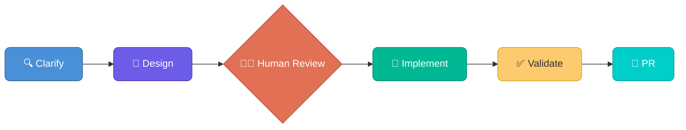

> **Disclaimer:** These workflows are intended for delivery via RTS (Resident Technical Services) as part of a Professional Services engagement. This repository should not be handed over without guided enablement — agentic infrastructure development requires mature IaC practices, layered guardrails, and operational readiness. Without these foundations, autonomous code generation against live infrastructure carries significant risk. Adoption and customization should be guided by a Resident Solutions Architect to ensure alignment with your organization's security posture, operational standards, and infrastructure maturity.
>
> **Get Started:** Engage via the **Lighthouse program** or reach out to **Fiona Black** directly.
> For technical guidance or queries reach out to **Simon Lynch** or **Aaron Evans**.

# Terraform Agentic Workflows

[](LICENSE)
[](https://www.terraform.io/)

A framework for agentic Infrastructure as Code development workflows using **Spec-Driven Development (SDD)** — a structured approach that guides AI agents through building production-ready Terraform code with guardrails at every phase. Built on industry standards like [agent skills](https://agentskills.io/) and subagents, this framework is designed to be generic and can be customized to work with any AI coding harness that supports these primitives. Validated with **Claude Code** and **GitHub Copilot CLI**. Coming soon Project Bob ...

> **Guardrails matter.** Agentic AI for critical infrastructure requires mature IaC practices and strong operational guardrails to deliver successful outcomes. **HCP Terraform** is a key component of this approach — providing remote execution, policy enforcement, state management, and approval workflows that keep AI-generated infrastructure safe and auditable.
>
> 
>
> **Note:** This repository is a framework for agentic development workflows for Infrastructure as Code. Customization to a customer's specific requirements, security posture, and best practices should be undertaken as a Resident Solutions Architect (RSA) engagement.
>
> **Learn more:** Visit [AI-Powered Infrastructure Engineering at Enterprise Scale](https://pages.github.ibm.com/AdvArch/tfai/) — a structured learning path for platform teams adopting autonomous HCP Terraform development, covering agent architecture, layered guardrails, Specification-Driven Development, and three validated workflow patterns.

## What is this?

This repository is a development template, not a deployed module. It provides orchestrated AI agent workflows for three core Terraform use cases, each following the same structure:


```mermaid
graph LR
    A["🔍 Clarify"] --> B["📐 Design"] --> C{"🧑‍💻 Human Review"}
    C --> D["🔨 Implement"] --> E["✅ Validate"] --> F["🚀 PR"]

    style A fill:#4a90d9,stroke:#2c5f8a,color:#fff,rx:8
    style B fill:#6c5ce7,stroke:#4a3db0,color:#fff,rx:8
    style C fill:#e17055,stroke:#b34a3a,color:#fff
    style D fill:#00b894,stroke:#008c6e,color:#fff,rx:8
    style E fill:#fdcb6e,stroke:#c9a224,color:#333,rx:8
    style F fill:#00cec9,stroke:#009e9a,color:#fff,rx:8
```

- **Clarify** — Gather requirements, resolve ambiguity, research AWS/provider docs
- **Design** — Produce a design document with architecture, interfaces, security controls
- **Human Review** — Approve the design before any code is written
- **Implement** — TDD: write tests first, then build to pass them
- **Validate** — Run the full quality pipeline (fmt, validate, test, tflint, trivy, docs)
- **PR** — Create a pull request with the implementation for final review

**Why use this?** Writing production-grade Terraform by hand is slow and error-prone — security defaults get missed, tests are skipped, documentation drifts. SDD with AI agents enforces quality at every phase, producing consistent, tested, documented infrastructure code in a fraction of the time.

**Can't I build my own workflows?** Yes — and many teams do. But getting agentic IaC right is harder than it looks. Naive prompting produces code that works in demos but fails in production: no tests, no security defaults, inconsistent structure, and no guardrails to prevent drift. This framework encodes months of iteration into reusable skills, constitutions, and validation pipelines. You get a proven starting point instead of rebuilding the same lessons from scratch — and because it's built on open standards (agent skills, subagents, MCP), you can extend and customize it rather than being locked in.

**Are these workflows designed to run in the IDE?** These workflows are designed for long-running, background agentic execution — not quick inline completions. We recommend starting in the IDE (VS Code devcontainer) as the fastest path to adoption. As practices mature, these same workflows can be centralized in cloud agent sandboxes such as [AWS AgentCore](https://aws.amazon.com/agentcore/), decoupling execution from individual developer machines, enabling platform-level orchestration, and unlocking dynamic secrets management for coding agent harnesses.

## Quick Start

**Prerequisites:** Docker Desktop, VS Code, GitHub fine-grained PAT, HCP Terraform Team API token, and either a **Claude Code** subscription or **GitHub Copilot** license.

```bash
# 1. Create a new repo from this template on GitHub, then clone it
git clone https://github.com/YOUR_ORG/your-new-repo.git
code your-new-repo

# 2. When VS Code prompts, click "Reopen in Container"
#    Choose claude-code or vscode-agent variant depending on your AI assistant

# 3. Validate your environment
bash .foundations/scripts/bash/validate-env.sh
```

All other tools (Terraform, TFLint, terraform-docs, Trivy, Go, GitHub CLI, and more) are pre-installed in the devcontainer.

See the **[Getting Started Guide](docs/getting_started.md)** for complete setup instructions including token configuration and branch protection.

## Core Workflows

Start any workflow by typing the slash command in your AI assistant's chat (Claude Code terminal or Copilot Chat). The same slash commands work in both tools:

| Workflow | Purpose | Plan & Design | Implement & Validate |
|----------|---------|----------------|----------------------|
| **Module Authoring** | Create reusable Terraform modules with direct provider resources and secure defaults | `/tf-module-plan` | `/tf-module-implement` |
| **Provider Development** | Build Terraform Provider resources using the Plugin Framework | `/tf-provider-plan` | `/tf-provider-implement` |
| **Consumer Provisioning** | Compose infrastructure from private registry modules | `/tf-consumer-plan` | `/tf-consumer-implement` |

## Day 2 Operations

| Workflow | Purpose | Trigger | Agent |
|----------|---------|---------|-------|
| **Consumer Module Uplift** | Automated module version upgrades with risk assessment, remediation, and post-merge apply | Dependabot PR | `module-upgrade-remediation` |

The **consumer module uplift** pipeline automates dependency management for consumer configurations:

1. **Dependabot** detects new module versions in the private registry
2. **GitHub Actions** classifies the version bump, runs `terraform plan`, and assesses risk
3. **Low-risk changes** (patch, adds-only) are auto-merged
4. **Breaking changes** trigger `@claude` — an AI agent that fetches the old/new module interfaces, fixes consumer code, and pushes the fix for re-validation

See [Day 2 Operations](docs/getting_started.md#day-2-operations--consumer-module-uplift) for full details.

## MCP Servers

Pre-configured [Model Context Protocol](https://modelcontextprotocol.io/) servers extend AI agent capabilities:

| Server | Description |
|--------|-------------|
| `terraform` | HCP Terraform — workspace management, run execution, registry lookups, variable management |
| `aws-documentation-mcp-server` | AWS documentation search, best practices, service recommendations |

Configured in `.mcp.json` and available automatically in the devcontainer.

## What's Included

- **Devcontainer** — Two variants: `claude-code` (Claude Code CLI) and `vscode-agent` (GitHub Copilot), both with Terraform 1.14, TFLint, terraform-docs, Trivy, Go 1.24, GitHub CLI, Vault Radar, Infracost, Checkov, golangci-lint, and pre-commit
- **Pre-commit hooks** — fmt, validate, docs, tflint, trivy, secret detection, Vault Radar (requires optional `VAULT_RADAR_LICENSE`)
- **TFLint** — AWS (0.46.0), Azure (0.31.1), and Terraform plugins with all 20 rules configured
- **Constitutions** — Non-negotiable rules for module, provider, and consumer code generation
- **Design templates** — Canonical starting points for each workflow's design phase
- **CI/CD pipelines** — Validation, apply, release, and consumer uplift workflows

## Documentation

| Resource | Description |
|----------|-------------|
| [Getting Started](docs/getting_started.md) | Environment setup and first workflow |
| [Documentation Site](docs/index.html) | Full reference site (open locally in browser — not rendered on GitHub) |
| [AGENTS.md](AGENTS.md) | Agent inventory, skills, and context management rules |

## Validated Models

This solution has been validated with the following models (listed in order of observed performance):

| Rank | Model | Provider |
|------|-------|----------|
| 1 | Opus 4.6 | Anthropic |
| 2 | ChatGPT 5.4 | OpenAI |
| 3 | Gemini 3 Pro | Google |

Model choice is up to customer preference — all three produce production-quality output. Evals generally show best results in the order above.

## Contributing

Contributions are welcome. Please open an issue to discuss proposed changes before submitting a pull request.

## License

This project is licensed under the [Apache License 2.0](LICENSE).

<!-- BEGIN_TF_DOCS -->
## Requirements

| Name | Version |
|------|---------|
| <a name="requirement_terraform"></a> [terraform](#requirement\_terraform) | >= 1.14 |
| <a name="requirement_archive"></a> [archive](#requirement\_archive) | >= 2.4 |
| <a name="requirement_aws"></a> [aws](#requirement\_aws) | >= 5.50 |
| <a name="requirement_opensearch"></a> [opensearch](#requirement\_opensearch) | >= 2.3 |
| <a name="requirement_time"></a> [time](#requirement\_time) | >= 0.11 |

## Providers

| Name | Version |
|------|---------|
| <a name="provider_aws"></a> [aws](#provider\_aws) | 6.43.0 |

## Modules

No modules.

## Resources

| Name | Type |
|------|------|
| [aws_caller_identity.current](https://registry.terraform.io/providers/hashicorp/aws/latest/docs/data-sources/caller_identity) | data source |
| [aws_partition.current](https://registry.terraform.io/providers/hashicorp/aws/latest/docs/data-sources/partition) | data source |
| [aws_region.current](https://registry.terraform.io/providers/hashicorp/aws/latest/docs/data-sources/region) | data source |

## Inputs

| Name | Description | Type | Default | Required |
|------|-------------|------|---------|:--------:|
| <a name="input_action_group_definitions"></a> [action\_group\_definitions](#input\_action\_group\_definitions) | Map of Lambda-backed action groups keyed by action group name. Each value provides description, target Lambda ARN, and either an OpenAPI schema (inline payload OR S3 location) or a function schema. The module creates one aws\_bedrockagent\_agent\_action\_group plus one aws\_lambda\_permission per entry. | <pre>map(object({<br/>    description = string<br/>    lambda_arn  = string<br/>    api_schema = optional(object({<br/>      payload = optional(string)<br/>      s3 = optional(object({<br/>        s3_bucket_name = string<br/>        s3_object_key  = string<br/>      }))<br/>    }))<br/>    function_schema = optional(object({<br/>      functions = list(object({<br/>        name        = string<br/>        description = string<br/>        parameters = optional(map(object({<br/>          type        = string<br/>          description = string<br/>          required    = optional(bool, false)<br/>        })))<br/>      }))<br/>    }))<br/>  }))</pre> | `{}` | no |
| <a name="input_agent_alias_name"></a> [agent\_alias\_name](#input\_agent\_alias\_name) | Name of the stable invocation alias pinned to the prepared agent version. | `string` | `"live"` | no |
| <a name="input_agent_name"></a> [agent\_name](#input\_agent\_name) | Stable name for the Bedrock agent and the prefix for derived resource names (KMS alias, log groups, IAM roles, AOSS collection). | `string` | n/a | yes |
| <a name="input_api_throttling_burst_limit"></a> [api\_throttling\_burst\_limit](#input\_api\_throttling\_burst\_limit) | Token-bucket burst limit on the API stage. | `number` | `200` | no |
| <a name="input_api_throttling_rate_limit"></a> [api\_throttling\_rate\_limit](#input\_api\_throttling\_rate\_limit) | Steady-state requests-per-second throttle on the API stage. | `number` | `100` | no |
| <a name="input_cors_configuration"></a> [cors\_configuration](#input\_cors\_configuration) | Optional CORS configuration for the HTTP API. Disabled when null (default). Setting allow\_origins = ["*"] is a security smell; document tradeoff in README. | <pre>object({<br/>    allow_origins = list(string)<br/>    allow_methods = list(string)<br/>    allow_headers = list(string)<br/>    max_age       = optional(number, 0)<br/>  })</pre> | `null` | no |
| <a name="input_cost_center"></a> [cost\_center](#input\_cost\_center) | Required organizational tag identifying the cost center for chargeback. | `string` | n/a | yes |
| <a name="input_enable_api_gateway"></a> [enable\_api\_gateway](#input\_enable\_api\_gateway) | When true, provision an HTTP API + invoker Lambda + access log group. The route is unauthenticated by default; consumer attaches authorizer using exposed outputs. | `bool` | `false` | no |
| <a name="input_enable_code_interpreter"></a> [enable\_code\_interpreter](#input\_enable\_code\_interpreter) | Attach the AWS-managed AMAZON.CodeInterpreter action group. Region-restricted: us-east-1, us-west-2, eu-central-1 only. | `bool` | `true` | no |
| <a name="input_enable_knowledge_base"></a> [enable\_knowledge\_base](#input\_enable\_knowledge\_base) | When true, provision the AOSS-backed knowledge base, IAM role, vector index, KB resource, S3 data source, and agent association. | `bool` | `false` | no |
| <a name="input_environment"></a> [environment](#input\_environment) | Required organizational tag identifying deployment environment. Applied to every taggable resource via local.required\_tags. | `string` | n/a | yes |
| <a name="input_force_destroy"></a> [force\_destroy](#input\_force\_destroy) | When true, sets skip\_resource\_in\_use\_check = true on action groups and the agent so terraform destroy can run while the alias references them. Off by default for safety. | `bool` | `false` | no |
| <a name="input_foundation_model"></a> [foundation\_model](#input\_foundation\_model) | Bedrock foundation model ID. Default is Claude Sonnet 4. Consumer must verify model availability in target region. | `string` | `"anthropic.claude-sonnet-4-20250514"` | no |
| <a name="input_guardrail_id"></a> [guardrail\_id](#input\_guardrail\_id) | Optional consumer-provided Bedrock Guardrail identifier to bind to the agent. Module does NOT create the guardrail in v1. | `string` | `""` | no |
| <a name="input_guardrail_version"></a> [guardrail\_version](#input\_guardrail\_version) | Guardrail version to pin. Defaults to DRAFT (mutable); pin to a numbered version in production examples. | `string` | `"DRAFT"` | no |
| <a name="input_idle_session_ttl_seconds"></a> [idle\_session\_ttl\_seconds](#input\_idle\_session\_ttl\_seconds) | Session idle timeout. Bedrock-allowed range 60-3600 seconds. | `number` | `600` | no |
| <a name="input_instruction"></a> [instruction](#input\_instruction) | Natural-language instruction prompt that defines the agent's behavior. AWS API requires 40-20000 chars when prepare\_agent runs. | `string` | n/a | yes |
| <a name="input_kms_key_arn"></a> [kms\_key\_arn](#input\_kms\_key\_arn) | Bring-your-own KMS CMK ARN. When empty, the module creates one with rotation enabled. Encryption is non-negotiable; this only controls key ownership. | `string` | `""` | no |
| <a name="input_knowledge_base_description"></a> [knowledge\_base\_description](#input\_knowledge\_base\_description) | Natural-language description used by the agent's planner to decide when to query the KB. This is functional, not cosmetic. | `string` | `"Use this knowledge base to retrieve relevant context from the customer document corpus."` | no |
| <a name="input_knowledge_base_embedding_model_id"></a> [knowledge\_base\_embedding\_model\_id](#input\_knowledge\_base\_embedding\_model\_id) | Embedding model ID for vectorization. Default Titan v2 at 1024 dimensions. | `string` | `"amazon.titan-embed-text-v2:0"` | no |
| <a name="input_knowledge_base_inclusion_prefixes"></a> [knowledge\_base\_inclusion\_prefixes](#input\_knowledge\_base\_inclusion\_prefixes) | Optional S3 key prefixes to restrict which objects in the bucket are ingested. When set, S3 IAM permissions are scoped via s3:prefix. | `list(string)` | `[]` | no |
| <a name="input_knowledge_base_s3_bucket_arn"></a> [knowledge\_base\_s3\_bucket\_arn](#input\_knowledge\_base\_s3\_bucket\_arn) | ARN of the consumer-supplied S3 bucket containing source documents for the knowledge base. Module never creates the bucket. | `string` | `""` | no |
| <a name="input_knowledge_base_s3_kms_key_arn"></a> [knowledge\_base\_s3\_kms\_key\_arn](#input\_knowledge\_base\_s3\_kms\_key\_arn) | Optional CMK ARN if the source S3 bucket uses a customer-managed key; the KB role is granted kms:Decrypt on this key. | `string` | `""` | no |
| <a name="input_log_retention_days"></a> [log\_retention\_days](#input\_log\_retention\_days) | Retention for all CloudWatch log groups created by the module. Validated against CloudWatch Logs allowed values. | `number` | `90` | no |
| <a name="input_owner"></a> [owner](#input\_owner) | Required organizational tag identifying the owning team or person (e.g., team-genai@example.com). | `string` | n/a | yes |
| <a name="input_project"></a> [project](#input\_project) | Required organizational tag identifying the project for grouping and reporting. | `string` | n/a | yes |
| <a name="input_tags"></a> [tags](#input\_tags) | Free-form additional tags merged with required tags and Name / ManagedBy = "terraform" defaults. Consumer-provided keys override module defaults. | `map(string)` | `{}` | no |
| <a name="input_wait_after_prepare_seconds"></a> [wait\_after\_prepare\_seconds](#input\_wait\_after\_prepare\_seconds) | Delay between the final PrepareAgent and CreateAgentAlias to work around eventual-consistency on agent\_version. Set 0 to disable. | `number` | `10` | no |

## Outputs

| Name | Description |
|------|-------------|
| <a name="output_agent_alias_arn"></a> [agent\_alias\_arn](#output\_agent\_alias\_arn) | Full ARN of the agent alias — the invocation target consumers should use with bedrock-agent-runtime:InvokeAgent. |
| <a name="output_agent_alias_id"></a> [agent\_alias\_id](#output\_agent\_alias\_id) | Identifier of the stable invocation alias. |
| <a name="output_agent_arn"></a> [agent\_arn](#output\_agent\_arn) | Full ARN of the Bedrock agent. |
| <a name="output_agent_id"></a> [agent\_id](#output\_agent\_id) | Short identifier of the Bedrock agent (e.g., GGRRAED6JP). Use this in cross-resource references. |
| <a name="output_agent_role_arn"></a> [agent\_role\_arn](#output\_agent\_role\_arn) | ARN of the agent execution role for downstream IAM policy references. |
| <a name="output_agent_version"></a> [agent\_version](#output\_agent\_version) | Current prepared agent version (numeric, e.g., "1"). |
| <a name="output_api_arn"></a> [api\_arn](#output\_api\_arn) | ARN of the API Gateway HTTP API for resource policies / WAFv2 association. |
| <a name="output_api_endpoint"></a> [api\_endpoint](#output\_api\_endpoint) | Invoke URL of the HTTP API (https://<id>.execute-api.<region>.amazonaws.com). |
| <a name="output_api_execution_arn"></a> [api\_execution\_arn](#output\_api\_execution\_arn) | Execution ARN of the API for aws\_lambda\_permission.source\_arn if the consumer adds more integrations. |
| <a name="output_api_id"></a> [api\_id](#output\_api\_id) | API Gateway v2 HTTP API identifier. Use with aws\_apigatewayv2\_authorizer to attach an authorizer. |
| <a name="output_data_source_id"></a> [data\_source\_id](#output\_data\_source\_id) | Identifier of the KB S3 data source — needed to trigger ingestion via the SDK (StartIngestionJob). |
| <a name="output_default_route_key"></a> [default\_route\_key](#output\_default\_route\_key) | The default route key (POST /invoke) — used by consumers when overriding authorization\_type via aws\_apigatewayv2\_route. |
| <a name="output_invoker_lambda_arn"></a> [invoker\_lambda\_arn](#output\_invoker\_lambda\_arn) | ARN of the bundled invoker Lambda function. |
| <a name="output_invoker_lambda_name"></a> [invoker\_lambda\_name](#output\_invoker\_lambda\_name) | Name of the bundled invoker Lambda function. |
| <a name="output_kms_key_arn"></a> [kms\_key\_arn](#output\_kms\_key\_arn) | ARN of the KMS CMK used for at-rest encryption (created by the module or passed in). |
| <a name="output_knowledge_base_arn"></a> [knowledge\_base\_arn](#output\_knowledge\_base\_arn) | ARN of the Bedrock knowledge base, or null when disabled. |
| <a name="output_knowledge_base_id"></a> [knowledge\_base\_id](#output\_knowledge\_base\_id) | Identifier of the Bedrock knowledge base, or null when disabled. |
| <a name="output_knowledge_base_role_arn"></a> [knowledge\_base\_role\_arn](#output\_knowledge\_base\_role\_arn) | ARN of the KB execution role. |
| <a name="output_log_group_arn"></a> [log\_group\_arn](#output\_log\_group\_arn) | ARN of the agent CloudWatch log group. |
| <a name="output_log_group_name"></a> [log\_group\_name](#output\_log\_group\_name) | Name of the agent CloudWatch log group. |
| <a name="output_opensearch_collection_arn"></a> [opensearch\_collection\_arn](#output\_opensearch\_collection\_arn) | ARN of the AOSS vector collection. |
<!-- END_TF_DOCS -->
