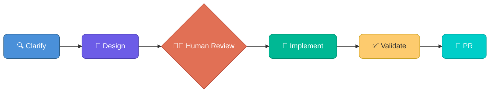
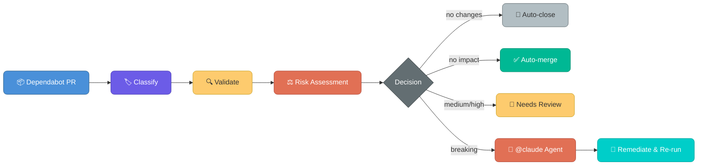

# Getting Started

## Overview

**Terraform Agentic Workflows** is a development template that uses AI agents to build production-ready Terraform code through **Spec-Driven Development (SDD)** — a structured workflow:



It supports three core use cases:

- **Module Authoring** — Create reusable Terraform modules with raw resources and secure defaults
- **Provider Development** — Build Terraform Provider resources using HashiCorp's Plugin Framework
- **Consumer Provisioning** — Compose infrastructure from private registry modules and deploy to HCP Terraform

Each workflow is driven by slash commands (e.g., `/tf-module-plan`) that orchestrate multiple AI agents through the phases. The template supports two AI coding assistants:

| Assistant | Devcontainer | Skills & agents | MCP config |
|-----------|-------------|-----------------|------------|
| **Claude Code** | `.devcontainer/claude-code/` | `.claude/skills/` and `.claude/agents/` | `.mcp.json` |
| **GitHub Copilot** | `.devcontainer/vscode-agent/` | `.claude/skills/`, `.claude/agents/`, and `.github/agents/` | `devcontainer.json` (`customizations.vscode.mcp`) |

The same slash commands work in both tools. Copilot CLI supports skill and agent lookup from `.claude/` directories in addition to `.github/agents/`. The underlying tool names differ between the two (see [Tool Name Mapping](tool-name-mapping.md)), but the user experience is the same.

---

## Prerequisites

### Required Software

Install these on your **host machine** — everything else is provided by the devcontainer:

| Tool | Purpose |
|------|---------|
| [Docker Desktop](https://www.docker.com/products/docker-desktop/) | Run the devcontainer |
| [VS Code](https://code.visualstudio.com/) | IDE with Dev Containers extension |

Install the **Dev Containers** extension in VS Code (`ms-vscode-remote.remote-containers`).

> All other tools (Terraform, TFLint, terraform-docs, Trivy, Go, GitHub CLI, Vault Radar, Claude Code CLI) are pre-installed inside the devcontainer.

### Required Accounts

- **GitHub** account with a [fine-grained personal access token](#1-github-fine-grained-personal-access-token)
- **HCP Terraform** account with a [Team API token](#2-hcp-terraform-setup)
- **AWS** account (you do not need AWS CLI or local credentials — all AWS access flows through HCP Terraform workspace variables)
- **AI assistant** — one of the following:
  - **Claude Code** — authenticate via `claude login` inside the devcontainer, or set `ANTHROPIC_API_KEY` in your shell profile
  - **GitHub Copilot** — requires a Copilot license; run `copilot login` inside the devcontainer or sign in via VS Code's built-in GitHub authentication when prompted

---

## Environment Setup

### 1. GitHub Fine-Grained Personal Access Token

Fine-grained tokens provide scoped access with granular permissions. Classic tokens (`ghp_*`) are not recommended.

**Create the token:**

1. Go to **GitHub Settings** → **Developer Settings** → **Personal access tokens** → **Fine-grained tokens**
2. Click **Generate new token**
3. Set a descriptive name and expiration
4. Under **Repository access**, select the repositories this template will manage
5. Set the following **Repository permissions**:

| Permission | Access | Why |
|------------|--------|-----|
| Contents | Read & Write | Clone, push, create branches |
| Issues | Read & Write | Create and update tracking issues |
| Pull requests | Read & Write | Create PRs, post comments |
| Workflows | Read & Write | Trigger and manage GitHub Actions |
| Metadata | Read | Required baseline |

6. Click **Generate token** and copy it immediately

**Export the token** (and add to your shell profile so it persists across sessions):

```bash
export GITHUB_TOKEN="github_pat_your_token_here"
# Add the line above to ~/.zshrc or ~/.bashrc for persistence
```

### 2. HCP Terraform Setup

The template uses HCP Terraform for remote execution, state management, and workspace automation. You need an isolated project with a dedicated team.

#### Create a Dedicated Project

1. Navigate to **Projects** in [HCP Terraform](https://app.terraform.io/)
2. Create a new project (e.g., `sandbox`)
3. This isolates test workspaces from production infrastructure

#### Create a Dedicated Team

1. Go to **Settings** → **Teams**
2. Create a new team and assign it to the dedicated project
3. Configure **Project Team Access** with these permissions:

**Project Access:**

| Permission | Required | Why |
|------------|----------|-----|
| Read | Yes | List and view project workspaces |
| Create Workspaces | Yes | Consumer workflows create sandbox workspaces |
| Delete Workspaces | Yes | Clean up sandbox workspaces after testing |

**Workspace Permissions:**

| Permission | Required | Why |
|------------|----------|-----|
| Read Variables | Yes | Inspect workspace configuration |
| Read State | Yes | Access state for planning and validation |
| Write State | Yes | Apply changes to workspace state |
| Download Sentinel Mocks | Yes | Policy testing support |
| Manage Workspace Run Tasks | Yes | Configure run task integrations |
| Lock/Unlock Workspaces | Yes | Prevent concurrent modifications during runs |

#### Generate Team API Token

1. Go to **Settings** → **Teams** → **[Your Team]**
2. Click **Create a team token**
3. Save this token — it cannot be retrieved later

> **Important:** This must be a **Team API Token**, not a user or organization token. The devcontainer maps `TEAM_TFE_TOKEN` to `TFE_TOKEN` automatically.

**Export the token** (and add to your shell profile so it persists across sessions):

```bash
export TEAM_TFE_TOKEN="your_terraform_team_token_here"
# Add the line above to ~/.zshrc or ~/.bashrc for persistence
```

> **Day 2 Operations:** If you plan to use the [consumer module uplift pipeline](#day-2-operations--consumer-module-uplift), also configure a `TFE_TOKEN_DEPENDABOT` repository secret (Settings -> Secrets and variables -> Dependabot) with read-only access to the private module registry.

### 3. AWS Credentials

AWS credentials are managed through HCP Terraform, not set locally. The devcontainer and CI runners never hold AWS credentials directly.

#### Option 1: Dynamic Provider Credentials (Recommended)

Use OIDC federation between HCP Terraform and AWS for short-lived, automatically rotated credentials.

See: [Dynamic Provider Credentials](https://developer.hashicorp.com/terraform/cloud-docs/workspaces/dynamic-provider-credentials/aws-configuration)

#### Option 2: Variable Set with Environment Variables

1. In HCP Terraform, go to **Settings** → **Variable Sets**
2. Create a new Variable Set with:

| Variable | Type | Sensitive |
|----------|------|-----------|
| `AWS_ACCESS_KEY_ID` | Environment | Yes |
| `AWS_SECRET_ACCESS_KEY` | Environment | Yes |
| `AWS_REGION` | Environment | No |

3. **Attach the Variable Set to your project** — all workspaces inherit credentials automatically

### 4. Shell Configuration

Verify that both tokens are in your shell profile (`~/.zshrc` or `~/.bashrc`) so the devcontainer can access them:

```bash
# ~/.zshrc or ~/.bashrc
export GITHUB_TOKEN="github_pat_your_token_here"
export TEAM_TFE_TOKEN="your_terraform_team_token_here"

# Optional: Vault Radar secret scanning in pre-commit hooks
# export VAULT_RADAR_LICENSE="your_license_here"
```

Reload your shell after editing:

```bash
source ~/.zshrc    # or: source ~/.bashrc
```

---

## First Run

### 1. Create Repository from Template

1. Navigate to this repository on GitHub
2. Click **Use this template** → **Create a new repository**
3. Name your repository, configure visibility, and click **Create repository**

### 2. Clone and Open in Devcontainer

```bash
git clone https://github.com/YOUR_ORG/your-new-repo.git
code your-new-repo
```

When VS Code opens, it will detect the devcontainer configuration and prompt you to **Reopen in Container**. The repository includes two devcontainer variants:

| Variant | Path | Use when |
|---------|------|----------|
| `claude-code` | `.devcontainer/claude-code/` | You have a Claude Code subscription (recommended for this template) |
| `vscode-agent` | `.devcontainer/vscode-agent/` | You use GitHub Copilot as your AI coding assistant |

The devcontainer includes all required tools pre-installed:

| Tool | Version | Purpose |
|------|---------|---------|
| Terraform | 1.14.x | Infrastructure as Code |
| TFLint | 0.60.x | Terraform linting |
| terraform-docs | 0.21.x | Documentation generation |
| Trivy | Latest | Security scanning |
| Go | 1.24.x | Provider development |
| GitHub CLI | Latest | Repository operations |
| Vault Radar | 0.43.x | Secret detection |
| Claude Code | Latest | AI agent orchestration (claude-code variant) |
| Infracost | 0.10.x | Cost estimation |
| Checkov | Latest | Policy-as-code scanning |
| golangci-lint | 2.10.x | Go linting (provider development) |
| pre-commit | Latest | Git hook management |

### 3. Validate Environment

Run the environment validation script to confirm everything is configured:

```bash
bash .foundations/scripts/bash/validate-env.sh
```

The script classifies checks as:

- **GATE** — Must pass to proceed (TFE_TOKEN, GITHUB_TOKEN, Terraform, GitHub CLI)
- **WARN** — Nice-to-have; degrades capability but doesn't block (TFLint, pre-commit, Trivy, terraform-docs)

If all gates pass, the script automatically initializes TFLint and installs pre-commit hooks.

### 4. Branch Protection (Recommended)

Configure [branch protection rules](https://docs.github.com/en/repositories/configuring-branches-and-merges-in-your-repository/managing-a-branch-protection-rule/about-protected-branches) or [repository rulesets](https://docs.github.com/en/repositories/configuring-branches-and-merges-in-your-repository/managing-rulesets/about-rulesets) on `main` to enforce quality gates before merge.

**Recommended settings:**

| Setting | Value | Why |
|---------|-------|-----|
| Require pull request before merging | Yes | All changes go through review |
| Required approvals | 1+ | Peer review for infrastructure code |
| Dismiss stale approvals on new commits | Yes | Re-review after changes |
| Require conversation resolution | Yes | All review comments addressed |
| Require status checks to pass | Yes | CI must be green before merge |
| Block force pushes | Yes | Protect audit trail |
| Block branch deletion | Yes | Prevent accidental deletion |

**Required status checks** (from `.github/workflows/validate.yml`):

- `Terraform Format Check`
- `Terraform Validate`
- `TFLint`
- `Trivy IaC Security Scan`
- `Validate Examples`

> **Important:** The template ships `validate.yml` with a `workflow_dispatch` trigger only. You must add a `pull_request` trigger for these to run automatically on PRs and appear as required status checks. Add this to the `on:` block:
>
> ```yaml
> on:
>   pull_request:
>     branches: [main]
>   workflow_dispatch:
> ```
>
> The `no-commit-to-branch` pre-commit hook (included in the template's `.pre-commit-config.yaml`) provides additional local protection against direct commits to `main`.
>
> **References:**
> - [Managing branch protection rules](https://docs.github.com/en/repositories/configuring-branches-and-merges-in-your-repository/managing-a-branch-protection-rule/managing-a-branch-protection-rule)
> - [Managing rulesets](https://docs.github.com/en/repositories/configuring-branches-and-merges-in-your-repository/managing-rulesets/managing-rulesets-for-a-repository)
> - [Required status checks](https://docs.github.com/en/repositories/configuring-branches-and-merges-in-your-repository/managing-a-branch-protection-rule/troubleshooting-required-status-checks)


### 5. Try Your First Workflow

Once validation passes, open your AI assistant and run your first workflow:

**Claude Code:**

```bash
# Open the Claude Code terminal, then type:
/tf-module-plan
```

**GitHub Copilot:**

Open Copilot Chat in agent mode (`@workspace`) and type:

```
/tf-module-plan
```

Both tools will walk you through clarification questions, research AWS docs and provider resources, then produce a design document in `specs/`. When you're ready to implement:

```
/tf-module-implement
```

This writes tests first (TDD), builds the module to pass them, and runs the full quality pipeline.

---

## Core Workflows

All three workflows follow the same SDD structure. Start any workflow by typing the slash command in Claude Code or Copilot Chat.

### Module Authoring

Create reusable Terraform modules with direct provider resources (not module wrappers), secure defaults, and comprehensive tests.

| Aspect | Detail |
|--------|--------|
| **Plan & Design** | `/tf-module-plan` |
| **Implement & Validate** | `/tf-module-implement` |
| **Constitution** | `.foundations/memory/module-constitution.md` |
| **Design template** | `.foundations/templates/module-design-template.md` |

**What it produces:**

- Standard module structure (`versions.tf`, `variables.tf`, `main.tf`, `outputs.tf`)
- `.tftest.hcl` test files with mock and integration scenarios
- Auto-generated `README.md` via terraform-docs
- Security controls (encryption, access, logging, tagging)

**Phases:**

1. **Clarify** — Gather requirements, ask clarification questions, research AWS docs and provider resources
2. **Design** — Produce `specs/{feature}/design.md` with architecture, interfaces, security controls, test scenarios
3. **Human Review** — Approve the design before any code is written
4. **Implement** — Write tests first (TDD), then build resources to pass them
5. **Validate** — Run `terraform fmt`, `validate`, `test`, `tflint`, `trivy`, `terraform-docs`
6. **PR** — Create a pull request with the implementation for final review

### Provider Development

Build Terraform Provider resources using HashiCorp's Plugin Framework.

| Aspect | Detail |
|--------|--------|
| **Plan & Design** | `/tf-provider-plan` |
| **Implement & Validate** | `/tf-provider-implement` |
| **Constitution** | `.foundations/memory/provider-constitution.md` |
| **Design template** | `.foundations/templates/provider-design-template.md` |

**What it produces:**

- Go resource implementation with CRUD operations
- Schema design with typed attributes and validators
- Acceptance test suite with sweep functions
- State migration handling

**Phases:**

1. **Clarify** — Research cloud service APIs, Plugin Framework patterns, existing providers
2. **Design** — Produce `specs/{feature}/provider-design-{resource}.md` with schema, CRUD logic, error handling
3. **Human Review** — Approve the design before any code is written
4. **Implement** — Write test stubs first, then implement CRUD methods
5. **Validate** — Run `go test`, `golangci-lint`, acceptance tests
6. **PR** — Create a pull request with the implementation for final review

### Consumer Provisioning

Compose infrastructure from private registry modules and deploy to HCP Terraform.

| Aspect | Detail |
|--------|--------|
| **Plan & Design** | `/tf-consumer-plan` |
| **Implement & Validate** | `/tf-consumer-implement` |
| **Constitution** | `.foundations/memory/consumer-constitution.md` |
| **Design template** | `.foundations/templates/consumer-design-template.md` |

**What it produces:**

- Consumer configuration composing private registry modules
- Workspace configuration with `cloud {}` backend
- Variable definitions and module wiring
- Sandbox deployment to HCP Terraform

**Phases:**

1. **Clarify** — Research available private registry modules, wiring patterns, workspace config
2. **Design** — Produce `specs/{feature}/consumer-design.md` with module selection, wiring, security
3. **Human Review** — Approve the design before any code is written
4. **Implement** — Compose modules, configure workspace, deploy to sandbox
5. **Validate** — Run `pre-commit`, verify deployment
6. **PR** — Create a pull request with the implementation for final review

> **Note:** Consumer code uses **only** private registry modules. Raw resources are prohibited except glue resources (`random_id`, `null_resource`, `terraform_data`). Module versions must use pessimistic constraints (`~> X.Y`).

---

## Day 2 Operations — Consumer Module Uplift

An automated pipeline for managing module version upgrades in consumer configurations. No manual version bumping required.

### How It Works



**Step-by-step:**

1. **Dependabot** detects a new module version in the private registry and creates a PR
2. **Classify** — Parses the git diff to detect which modules changed and the semver bump type (patch/minor/major)
3. **Validate** — Runs `terraform fmt` → `init` → `validate` → `tflint` → `plan`
4. **Risk Assessment** — A deterministic matrix (no AI) maps version type × plan impact to a risk level:

| Plan Impact | Patch/Minor | Major |
|-------------|-------------|-------|
| **No plan changes** | Auto-merge | Auto-merge |
| **Adds only** | Needs review (low) | Needs review (medium) |
| **Changes to existing** | Needs review (medium) | Needs review (high) |
| **Destroy/Replace** | Breaking (high) | Breaking (critical) |
| **Plan fails** | Breaking (high) | Breaking (critical) |

5. **Decision** — Labels the PR and acts:
   - **Auto-close** — No actual plan changes (Dependabot bumped version but nothing differs); close the PR
   - **Auto-merge** — Squash merge immediately (adds-only with patch/minor bump)
   - **Needs-review** — Post analysis comment, request human review
   - **Breaking-change** — Block merge, trigger `@claude` remediation agent

### Agent Remediation

When a breaking change is detected or the plan fails, the pipeline posts `@claude review and make a recommendation` as a PR comment. This triggers the `terraform-claude-review.yml` workflow, which invokes the **module-upgrade-remediation** agent. (Requires [Claude for GitHub](https://github.com/apps/claude) or equivalent app installed on the repository.)

The agent:

1. Fetches the **old and new module interfaces** from the private registry via [MCP](#mcp-servers)
2. Identifies missing inputs, removed outputs, type changes
3. Fixes the consumer `.tf` files (adds required inputs, updates output references)
4. Pushes the fix — the pipeline **re-runs automatically** on the adapted code
5. If the second pass is clean, the normal decision flow applies

### Post-Merge Apply

After a PR is merged to `main`:

1. Configuration is uploaded to the HCP Terraform workspace
2. A run is created and applied
3. On **success**: a comment is posted on the merged PR with the run link
4. On **failure**: an incident issue is created and a draft rollback PR is generated

### Configuration Files

| File | Purpose |
|------|---------|
| `.github/dependabot.yml` | Monthly scan of private Terraform registry |
| `.github/workflows/terraform-consumer-uplift.yml` | Multi-job uplift pipeline |
| `.github/workflows/terraform-apply.yml` | Post-merge apply workflow |
| `.github/workflows/terraform-claude-review.yml` | Handles `@claude` mention trigger on PRs |
| `.claude/agents/module-upgrade-remediation.md` | Claude agent for breaking change fixes |
| `.foundations/scripts/bash/classify-version-bump.sh` | Semver classification logic |

> **Note:** Dependabot requires a separate `TFE_TOKEN_DEPENDABOT` secret configured in your repository's Dependabot secrets (Settings → Secrets and variables → Dependabot). This token needs read-only access to the private module registry.

---

## What's Included

### Devcontainer

A fully configured development environment with all tools pre-installed. Open in VS Code and select **Reopen in Container**.

### MCP Servers

Configured in `.mcp.json`, available automatically in the devcontainer:

| Server | Description |
|--------|-------------|
| `terraform` | HCP Terraform — workspace management, run execution, registry lookups, variable management |
| `aws-documentation-mcp-server` | AWS documentation search, best practices, service recommendations |

### Pre-commit Hooks

Configured in `.pre-commit-config.yaml`, installed automatically by `validate-env.sh`:

| Hook | Purpose |
|------|---------|
| `terraform_fmt` | Canonical formatting |
| `terraform_validate` | Configuration validation |
| `terraform_docs` | Auto-generate README.md |
| `terraform_tflint` | Lint with `.tflint.hcl` rules |
| `terraform_trivy` | Security scanning (CRITICAL/HIGH/MEDIUM) |
| `end-of-file-fixer` | Consistent file endings |
| `check-yaml` | YAML syntax validation |
| `check-added-large-files` | Reject files > 500 KB |
| `check-merge-conflict` | Detect conflict markers |
| `detect-private-key` | Prevent credential commits |
| `no-commit-to-branch` | Protect `main` from direct commits (included in template) |
| `vault-radar-scan` | HashiCorp Vault Radar secret scanning |

### TFLint

Configured in `.tflint.hcl` with three plugins and full rule coverage:

| Plugin | Version | Rules |
|--------|---------|-------|
| AWS | 0.46.0 | Auto-enabled resource validation + `aws_resource_missing_tags` |
| Azure | 0.31.1 | Auto-enabled resource validation |
| Terraform | Built-in | All 20 rules explicitly configured (19 enabled, 1 disabled) |

### Constitutions

Non-negotiable rules that govern all AI-generated code. Agents read the relevant constitution before generating any code.

| Constitution | Governs |
|-------------|---------|
| `.foundations/memory/module-constitution.md` | File organization, naming, security defaults, testing |
| `.foundations/memory/provider-constitution.md` | Plugin Framework patterns, CRUD, state management |
| `.foundations/memory/consumer-constitution.md` | Module composition, workspace config, backend setup |

### Design Templates

Canonical starting points for Phase 2 design output. Each template defines the required sections for the design document.

| Template | Sections |
|----------|----------|
| `.foundations/templates/module-design-template.md` | Purpose, Resources, Interface, Security, Tests, Checklist |
| `.foundations/templates/provider-design-template.md` | Purpose, Schema, CRUD, Errors, Tests, Checklist |
| `.foundations/templates/consumer-design-template.md` | Purpose, Modules, Wiring, Security, Checklist |

---

## Project Structure

| Directory | Purpose |
|-----------|---------|
| `.claude/skills/` | Agent skills (slash commands) — used by both Claude Code and Copilot CLI |
| `.claude/agents/` | Subagent definitions (research, design, validate, remediate) — used by both Claude Code and Copilot CLI |
| `.github/agents/` | GitHub Copilot agent definitions (same roles, Copilot tool names) |
| `.foundations/memory/` | Constitutions — non-negotiable code generation rules |
| `.foundations/templates/` | Design document templates |
| `.foundations/scripts/bash/` | Automation scripts (validate, checkpoint, progress, classify) |
| `.github/workflows/` | CI/CD pipelines (validate, apply, release, uplift) |
| `specs/` | Feature design documents (created dynamically per workflow) |
| `docs/` | Documentation (this guide, reference site, tool mappings) |

---

## Additional Resources

- **[Documentation Site](index.html)** — Full reference site covering foundations, guardrails, SDD workflow, and configuration (open `docs/index.html` in your browser)
- **[AGENTS.md](../AGENTS.md)** — Agent inventory, skill list, and context management rules
- **[Tool Name Mapping](tool-name-mapping.md)** — Copilot CLI vs Claude Code tool name differences
